# 🧘 Fitness Class Booking API

RESTful API built with **Laravel 12** + **Sanctum** + **PostgreSQL**, designed to manage classes, schedules, sessions, and reservations for a Pilates / Boxing / Gym center.

---

## 📌 Key Features

-   Authentication with **Sanctum** (Bearer Tokens).
-   User roles: `admin`, `instructor`, `student`.
-   CRUD for:
    -   **Class Types**
    -   **Class Schedules** (weekly recurring)
    -   **Class Sessions** (specific instances)
    -   **Reservations**
-   Business rules:
    -   Capacity control.
    -   Minimum attendees required to run a class.
    -   Reservation cancellation deadline.
    -   Attendance tracking and penalties for no-shows.
-   Role-based authorization via **Policies**.
-   Clean and consistent **JSON responses**.

---

## 🚀 Requirements

-   PHP >= 8.2
-   Composer
-   PostgreSQL >= 14
-   Node.js & npm (optional, for a future frontend)

---

## ⚙️ Installation

```bash
# Clone repository
git clone https://github.com/luisferdk/fitness-class-booking-api.git
cd fitness-class-booking-api

# Install dependencies
composer install

# Copy environment file
cp .env.example .env

# Generate app key
php artisan key:generate

# Configure database in .env
DB_CONNECTION=pgsql
DB_HOST=127.0.0.1
DB_PORT=5432
DB_DATABASE=pilates
DB_USERNAME=postgres
DB_PASSWORD=secret

# Run migrations and seeders
php artisan migrate --seed
```

---

## 🔑 Authentication

The API uses **Laravel Sanctum** with **Bearer Tokens**.

### Register

```bash
curl --location 'http://127.0.0.1:8000/api/register' \
--header 'Accept: application/json' \
--header 'Content-Type: application/json' \
--data '{
  "name": "Student User",
  "email": "student@example.com",
  "password": "Password123#",
  "password_confirmation": "Password123#"
}'
```

### Login

```bash
curl --location 'http://127.0.0.1:8000/api/login' \
--header 'Accept: application/json' \
--header 'Content-Type: application/json' \
--data '{
  "email": "admin@example.com",
  "password": "Password123#"
}'
```

Response:

```json
{
    "token": "1|abcdef...",
    "user": {
        "id": 1,
        "name": "Admin",
        "email": "admin@example.com",
        "role": "admin"
    }
}
```

Use the token in every request:

```
Authorization: Bearer <token>
```

### Logout

```bash
curl --location --request POST 'http://127.0.0.1:8000/api/logout' \
--header 'Authorization: Bearer <token>'
```

### Get Authenticated User

```bash
curl --location 'http://127.0.0.1:8000/api/me' \
--header 'Authorization: Bearer <token>'
```

---

## 📚 Main Endpoints

### Class Types

-   `GET /api/class-types` → list (all roles)
-   `POST /api/class-types` → create (admin only)
-   `PUT /api/class-types/{id}` → update (admin only)
-   `DELETE /api/class-types/{id}` → delete (admin only)

### Class Schedules

-   `GET /api/class-schedules` → list
-   `POST /api/class-schedules` → create (admin/instructor)
-   `PUT /api/class-schedules/{id}` → update (admin/instructor)
-   `DELETE /api/class-schedules/{id}` → delete (admin/instructor)

### Class Sessions

-   `GET /api/class-sessions` → list
-   `POST /api/class-sessions` → create (admin/instructor)
-   `PUT /api/class-sessions/{id}` → update (admin/instructor)
-   `DELETE /api/class-sessions/{id}` → delete (admin/instructor)

### Reservations

-   `GET /api/reservations` → my reservations (student)
-   `POST /api/reservations` → create reservation
-   `DELETE /api/reservations/{id}` → cancel reservation
-   `POST /api/reservations/{id}/cancel` → explicit cancel
-   `POST /api/reservations/{id}/check-in` → mark attendance

---

## 🔄 User Flows

### Student Flow

```mermaid
flowchart TD
    A[Login /api/login] -->|Bearer Token| B[/GET /api/class-types/]
    B --> C[/GET /api/class-schedules/]
    C --> D[/GET /api/class-sessions/]
    D --> E["POST /api/reservations {session_id}"]
    E --> F[/GET /api/reservations/]
    F --> G["POST /api/reservations/{id}/check-in"]
    G --> H[Reservation completed 🎉]
```



### Admin Flow


---

## 🧪 Testing

Run the full test suite:

```bash
php artisan test
```

Run a specific test:

```bash
php artisan test --filter=ClassTypeAsAdminTest
```

---

## 🗂️ Project Structure

```bash
app/
├── Http/
│   ├── Controllers/        # API controllers
│   └── Middleware/         # Middleware for auth & roles
├── Models/                 # Eloquent models (User, ClassType, etc.)
├── Policies/               # Authorization policies
database/
├── factories/              # Model factories
├── migrations/             # Database migrations
├── seeders/                # Seed data (roles, demo users)
tests/
├── Feature/                # Feature & endpoint tests
└── Unit/                   # Unit tests
routes/
├── api.php                 # API routes
└── web.php                 # Web routes (minimal)
```

---

## 👩‍💻 Demo Roles (seeders)

-   **Admin**

    -   email: `admin@example.com`
    -   password: `Password123#`

-   **Instructor**

    -   email: `instructor@example.com`
    -   password: `Password123#`

-   **Student**

    -   email: `student@example.com`
    -   password: `Password123#`

---
